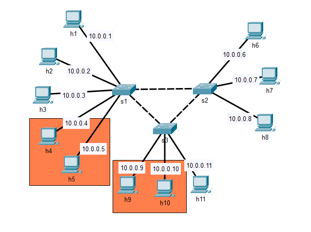
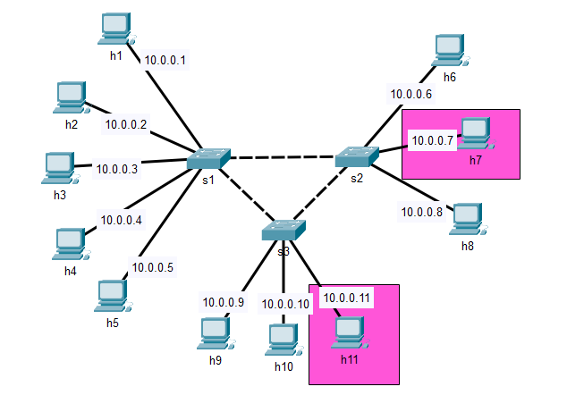

# On_demand_slicing - NetworkingII Activity Project #

## Introduction ##
The goal of this project is to implement a network slicing approach to enable dynamic activation/de-activation of network slices via CLI commands within Comnetsemu enviroment. The original Comnetsemu source code with all the detailed examples can be found [here](https://git.comnets.net/public-repo/comnetsemu.git).

A multi-hop technology is used for this emulation --> there are 11 hosts (h1,h2,h3,h4,h5,h6,h7,h8,h9,h10,h11) and 3 switches (s1,s2,s3) in the network:


## Project Description ##
Initially, all hosts can not communicate with each other and no slices are available.
After that, you can decide to activate one, more or all slices by passing an ON command to the ryu controller, and you can deactivate them with an OFF command (see the [how to run section](How-to-run:)).

The available slices are:

* ### Slice 1 ###

* ### Slice 2 ###

* ### Slice 3 ###

* ### Slice 4 ###


This folder contains the following files:
* topology.py -> python script to build the network as shown in the previous image.
* slicing.py -> python script that permits to activate/de-activate slices via CLI commands.
* initial_scenerio.sh -> bash script that deny hosts to communicate with each other.
* slice1.sh, slice2.sh, slice3.sh, slice4.sh -> bash scripts that build virtual queues that are used for communication between hosts.

<a name="How-to-run">## How to run: ##</a>
1. Connect with a comnetsemu portale (recommended) or install all the functionalities in your system
2. Open 2 tab
3. Run the controller
```bash
$ ryu-manager slicing.py
```
4. Emulate the topology with mininet
```bash
$ sudo python3 topology.py
```
5. Insert ON and OFF command in the ryu controller tab
	* write ON to activate all slices
	* write ON n to activate only slice n (with n between 1 and 4)
	* write OFF to de-activate all slices
	* write OFF n to de-activate only slice n (with n between 1 and 4)

*Note 1:* Please stop the running Ryu controller before starting a new Ryu controller.

*Note 2:* When you want to stop the mininet, please delete the topology as follows:
```bash
mininet> exit
$ sudo mn -c
```

